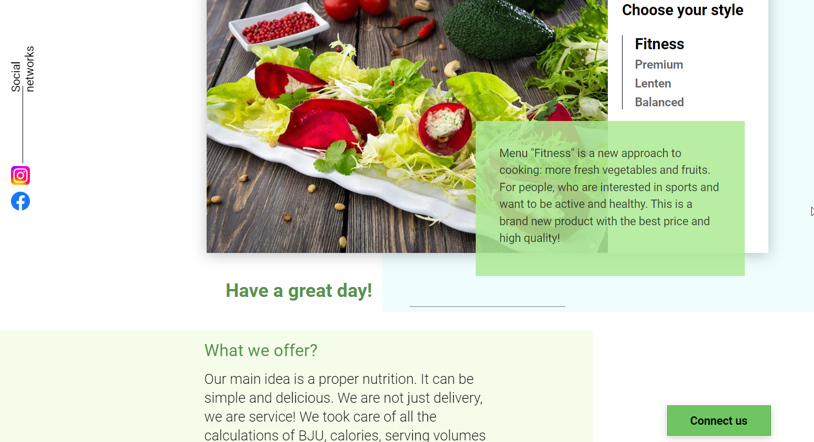

[![Dependencies][dependency-shield]][dependency-url]
[![LinkedIn][linkedin-shield]][linkedin-url]

# Food menu javascript app

Small javascript project for food delivery menu



### Built With

* [![Javascript][Javascript.io]][Javascript-url]
* [![NodeJs][NodeJs.io]][NodeJs-url]

## Pre-installations

#### Npm install:

  ```sh
  npm install npm@latest -g
  ```

#### Clone the repo:

```sh
git clone https://github.com/Lesash13/food_menu_javascript_app.git
```

#### Start Chrome without cors policy:
```
chrome.exe --user-data-dir="C:/Chrome dev session" --disable-web-security
```

## Usage

#### Backend local server for fetch requests:
```sh
 python .\server\app\server.py
```

#### Open index.html:
```
"Alt+F2"
or 
http://localhost:63342/food_menu/index.html
```

<!-- MARKDOWN LINKS & IMAGES -->

[dependency-shield]: https://img.shields.io/badge/Dependency_Graph-darkgreen?style=for-the-badge

[dependency-url]: https://github.com/Lesash13/angular-app/network/dependencies

[linkedin-shield]: https://img.shields.io/badge/-LinkedIn-black.svg?style=for-the-badge&logo=linkedin&colorB=darkblue

[linkedin-url]: https://www.linkedin.com/in/victoriya-mitrofanova-96839278/

[Javascript.io]: https://img.shields.io/badge/-JavaScript-lightyellow?style=for-the-badge&logo=javascript

[Javascript-url]: https://www.javascript.com/

[NodeJs.io]: https://img.shields.io/badge/-Node.js-green?style=for-the-badge&logo=Node.js

[NodeJs-url]: https://nodejs.org/en/

